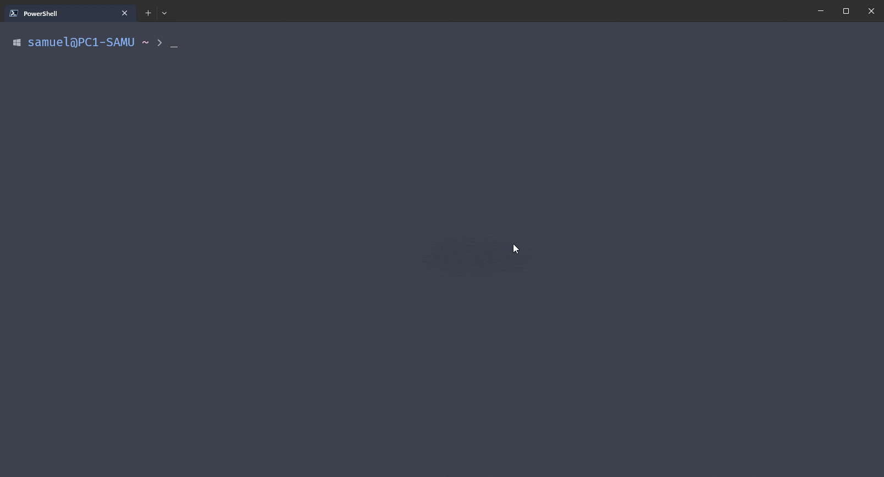

# Px To Rem

Esta función sencilla convierte los píxeles a rem, desde la terminal. Muy útil la verdad. 😄

## Instalación

1. Abre una terminal con Powershell.
2. Ejecuta el siguiente comando.

   ```powershell
   Invoke-WebRequest -Uri "https://raw.githubusercontent.com/samueleitorme/pxtorem/main/pxtorem.ps1" -OutFile "$env:USERPROFILE\Documents\Powershell\Scripts\pxtorem.ps1"
   ```

   De esta forma simplemente poniendo `pxtorem` en la terminal funciona.

---
Otra forma de instalación
Crea un script en 

## Ejemplo de uso

  - **Ejecución**

    ```powershell
    # Sintaxis
    # pxtorem <pixeles> <base=16>
    pxtorem 64
    ```

  - **Salida**

    ```powershell
    64px -> 4rem
    ```
  - **Ayuda**

    ```powershell
    Get-Help pxtorem
    ```


